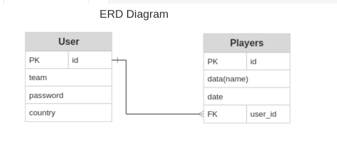
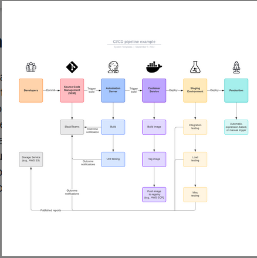
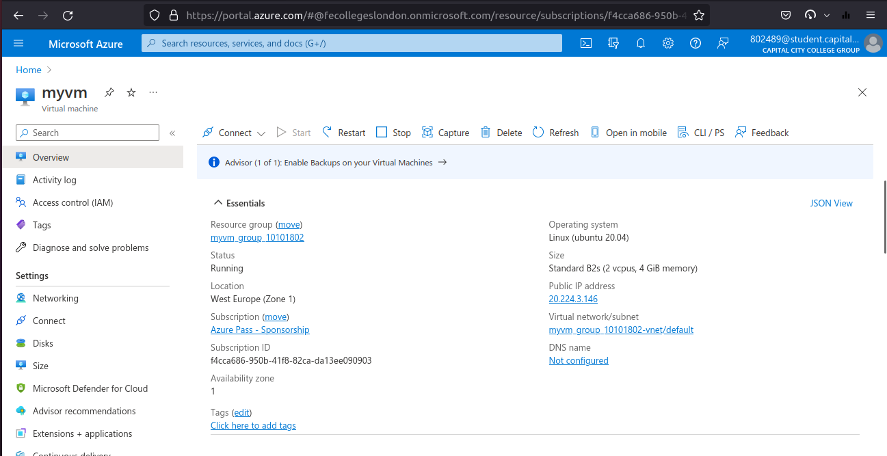
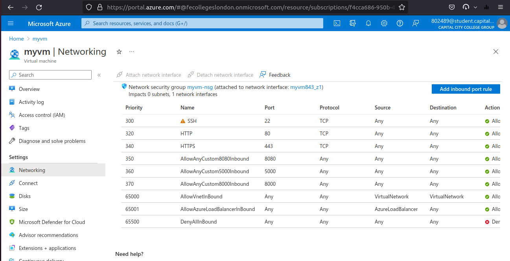
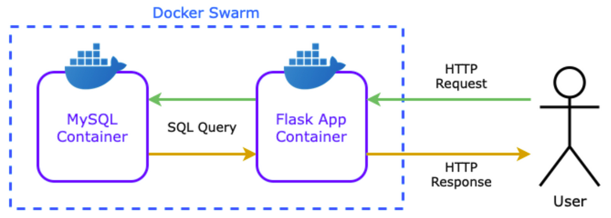

The application is a monolithic Flask application that serves both the frontend and backend of the application.
The frontend aspect of the app will use HTML templates to serve the web pages that allow the user to perform CRUD functionality with information from the database.
The backend aspect of the application will use SQLAlchemy to model and integrate with the database.

A DevOps pipeline apllied to this project is a set of automated processes and tools that allows developers and operations professionals to collaborate on building and deploying code to a production environment. Pipelines elements integrate Github,Jenkins amd Docker

Looking for improve at existing project that could be work at front side of this application to make user interface and usability higher, also visual aspect is nice to make better. Backend could be enhance about more complex database structure able to collect and store additional informations and serve it back to user. Additional units testing is also good to add into pipeline flow. 

# How Program works
# Entity Relationship Diagram (ERD)

# Full CI/CD pipeline diagram

# Cloud infrasctructure and network resources

# Component-level diagram, illustrating how the application interfaces with the database

# Video (to watch please click link below and after ,click - View Raw):

https://github.com/pbgo2/qaprojectpb/blob/master/Screencast%20from%2028-10-22%2014:10:20.webm

